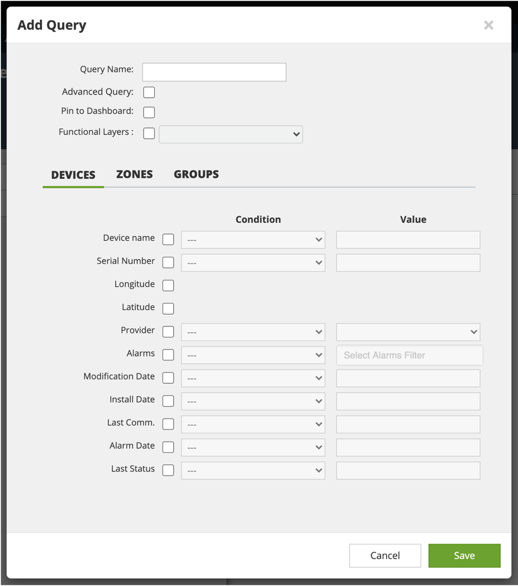
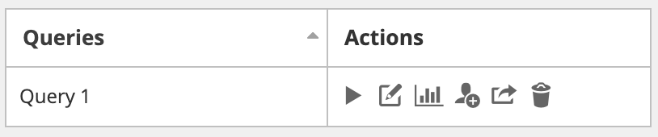
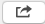
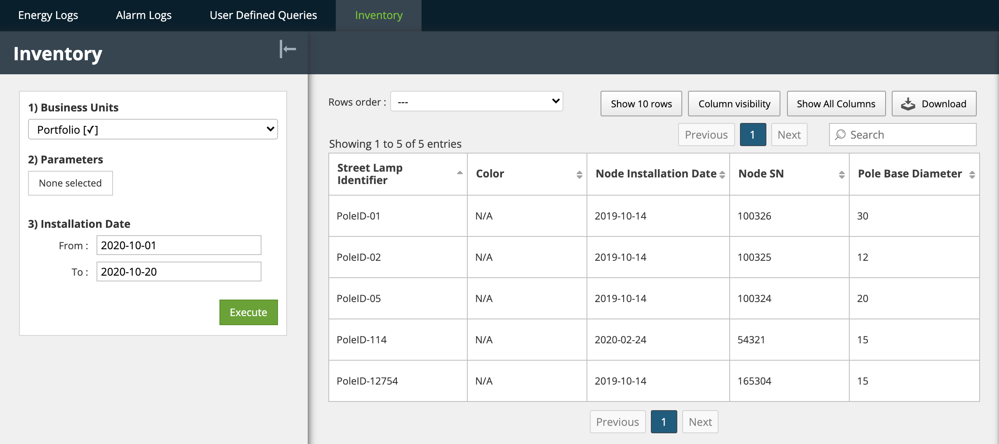

# SCMS User Guide

## 

## User Guide

SCMS V20.2

Reports Menu

## Reports: User Defined Queries

This section contains information and instructions for using the features accessed via the “Reports– User Defined Queries” tab in the Dimonoff \| SCMS platform.

Since many users use them, energy and alarm logs are prepackaged in Dimonoff \| SCMS. Users can also design their own reports, otherwise known as user defined queries.

### Create a User Defined Query

To create a user defined query, follow these steps:

1. Click “Reports” in the main menu.

Click the “User Defined Queries” tab.

Click the “Add” icon. The “Add Query” dialog appears.

**Note**: Personalized requests are only visible to the user who improves them. However, it is possible to share your personalized queries with other users. For more information on sharing, please refer to the “[Sharing a custom request]()” section.

Complete these fields at the top of the dialog:

| **Fields** | **Instructions** |
| :--- | :--- |
| Query Name | Enter a name for the report. Use words in the report that help other people identify the report’s contents \(examples: device names, functional layers, equipment providers\). |
| Advanced Query | Click this checkbox to open a window and make a SQL request. |
| Pin to Dashboard | Check this box so that the query is available directly on the “Dashboard” menu. When this box is checked, a new panel will be displayed on the Dashboard, which allows a quick and easy access to this request. |
| Functional Layers | Click this checkbox and choose a functional layer from the drop list to limit the report’s results to devices in a specific functional layer. If you choose a functional layer, the “Add Query” dialog gains a fourth tab: “Parameters”. If you do not select a layer works, the search is done for all objects. |

Complete all required fields in the “Devices” section \(illustrated earlier in this sequence of instructions\). To include device information, click the check box associated with that information in the dialog. It is possible to select only one box.

| **Fields** | **Instructions \(to include this information, click its check box\)** |
| :--- | :--- |
| Device Name | Choose an arithmetic operator from the Condition drop list \(Greater Than, Equal, or Less Than\) and enter a value against which Dimonoff \| SCMS can test that condition. |
| Serial Number | Choose an arithmetic operator from the Condition drop list \(Greater Than, Equal, or Less Than\) and enter a value against which Dimonoff \| SCMS can test that condition. |
| Longitude | Simply click the check box. |
| Latitude | Simply click the check box. |
| Provider | Choose “Equal” from the Condition drop list, then choose the equipment provider from the Value drop list. |
| Alarms | Choose “Equal” from the Conditions drop list, then click the Value field to include all the alarm types to include in this query. |
| Modification Date | Choose an operator from the Condition drop list \(Greater Than, Equal, Less Than, Today, or Between\) then choose a date by clicking in the Value field. The value field becomes inactive if “Today” is chosen. The value field splits into two fields if “Between” is chosen. |
| Install Date | Choose an operator from the Condition drop list \(Greater Than, Equal, Less Than, Today, or Between\) then choose a date by clicking in the Value field. The value field becomes inactive if “Today” is chosen. The value field splits into two fields if “Between” is chosen. |
| Last Comm. Date | Choose an operator from the Condition drop list \(Greater Than, Equal, Less Than, Today, or Between\) then choose a date by clicking in the Value field. The value field becomes inactive if “Today” is chosen. The value field splits into two fields if “Between” is chosen. |
| Alarm Date | Choose an operator from the Condition drop list \(Greater Than, Equal, Less Than, Today, or Between\) then choose a date by clicking in the Value field. The value field becomes inactive if “Today” is chosen. The value field splits into two fields if “Between” is chosen. |

In the “Zones” section:

Click the check box.

Choose an arithmetic operator from the “Condition” drop list \(Greater Than, Equal, or Less Than\). This operator is optional.

Enter a value against which Dimonoff \| SCMS can test that condition.

Complete all required fields in the “Groups” section. To include device information, click the check box associated with that information in the dialog.

| **Fields** | **Instructions \(to include this information, click its check box\)** |
| :--- | :--- |
| Group Name | Choose an arithmetic operator from the Condition drop list \(Greater Than, Equal, or Less Than\) and enter a value against which Dimonoff \| SCMS can test that condition. |
| Group Code | Choose an arithmetic operator from the Condition drop list \(Greater Than, Equal, or Less Than\) and enter a value against which Dimonoff \| SCMS can test that condition. |

If you chose the Functional Layers check box earlier in this sequence of instructions, the “Parameters” section is also available. For more information, refer to the first table of the “[Create a User Defined Query]()” section.

Click “Save”.

The query appears in the list of user defined queries, along with icons that enable user action.

### Run a User Defined Query

To run a user defined query, follow these steps:

1. Click “Reports” in the main menu.

Click the “User Defined Queries” tab.

Find the query in the list of queries that appears and click the “Execute” icon.

### Modify a User Defined Query

To modify a user defined query, follow these steps:

1. Click “Reports” in the main menu.

Click the “User Defined Queries” tab.

Find the query in the list of queries that appears and click the “Edit” icon.

### View Query Results in a Chart

To view a user defined query as a chart, follow these steps:

1. Click “Reports” in the main menu.

Click the “User Defined Queries” tab.

Find the query in the list of queries that appears and click the “Chart” icon.

The Chart Query: \(query name\) dialog appears.

This example was taken from a prebuilt sample and includes criteria from that sample query.

The appearance of a Chart Query dialog will differ according to the criteria used to build that query and will not necessarily resemble the one below.

To exit this dialog at any time, lick the X in the top right corner or click inside the browser but outside the dialog.

Complete these fields.

| **Fields** | **Instructions** |
| :--- | :--- |
| Title | Enter a name for the chart. Use words that pertain to the content of the chart, such as a grouping of installation dates or a device name. |
| Pin to Dashboard | Check this box so that the query is available directly on the Dashboard menu. When this box is checked, a new panel will be displayed on the Dashboard, which allows a quick and easy access to this request. |
| Select Queries | Choose query data from the list. |

Click “Next”. If you don’t see the “Next” button, scroll down in this dialog.

In “Chart” types, choose the type of chart you want to use for your data and click “Finish”. The chart appears.

### Share a User Defined Query

You can share a query with other Dimonoff \| SCMS users. To do so, follow these steps:

1. Click “Reports” in the main menu.

Click the “User Defined Queries” tab.

Find the query in the list of queries that appears and click the “Share” icon.

The “Share Query: \(query name\)” dialog appears.

Select a user from the “Share To:” drop list and click “Save”. This user will be able to accept or not the request using a window that will appear to ask him when he goes to the “Reports – User Defined Query” menu.

### Export Results of a User Defined Query

To export the results of a user defined query in a CSV format, follow these steps:

1. Click “Reports” in the main menu.

Click the “User Defined Queries” tab.

Find the query in the list of queries that appears and click the “Export” icon.

### Delete a User Defined Query

To delete a user defined query, follow these steps:

1. Click “Reports” in the main menu.

Click the “User Defined Queries” tab.

Find the query in the list of queries that appears and click the “Delete” icon.

A confirmation dialog appears.

Click “Yes”.

## Reports: Inventory

The Inventory tab allows users to view their inventory of objects imported in Dimonoff \| SCMS. It is possible to search in the Inventory by business unit, by a configurable list of parameters and by ranges of installation dates. It is also possible to export the table using the "Download" icon at the top right of the image below.

To configure this tab, you must contact the Dimonoff support. The tab is not active by default.

