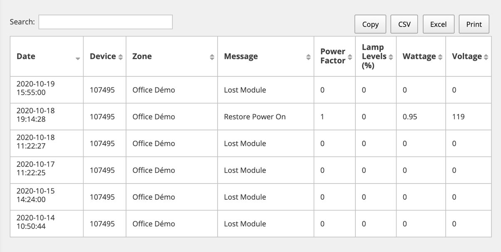
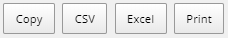

# Alarms Logs

This section contains information and instructions for using the features accessed via the “Reports– Alarm Logs” tab in the Dimonoff \| SCMS platform.

Alarms serve to alert system administrators of issues with devices in the field. Dimonoff \| SCMS records all alarms in its database and administrators can review those alarms as a whole or by filtering for specific criteria. For example, a report can show only alarms that occur in zone X over the preceding week.

### Running an Alarm Logs Report

To run an alarm logs report, follow these steps:

1. Click the “Reports” menu.

Click the “Alarms Logs” tab. The “Alarms Logs” dialog appears.

Complete these fields.

<table>
  <thead>
    <tr>
      <th style="text-align:left"><b>Fields</b>
      </th>
      <th style="text-align:left"><b>Instructions</b>
      </th>
    </tr>
  </thead>
  <tbody>
    <tr>
      <td style="text-align:left">Zone</td>
      <td style="text-align:left">Choose the zone for which you want to run the report or choose &#x201C;System
        Wide&#x201D; to see all alarms across all zones.</td>
    </tr>
    <tr>
      <td style="text-align:left">Start and End Dates</td>
      <td style="text-align:left">Choose a date range for the alarm logs you want to view.</td>
    </tr>
    <tr>
      <td style="text-align:left">Alarms Actions</td>
      <td style="text-align:left">
        
Choose &#x201C;All&#x201D;, &#x201C;Alarms by network&#x201D; or &#x201C;Alarm
          specifics&#x201D;.

        
If you choose &#x201C;Alarms by network&#x201D;, choose networks (manufacturers)
          in the field that appears below this drop list. You can add multiple networks.

        
If you choose &#x201C;Alarms specifics&#x201D;, choose specific alarm
          issues by clicking the field that appears below this drop list. You can
          add multiple specifics by clicking multiple times in the field.

      </td>
    </tr>
  </tbody>
</table>

Click “Execute”. The report appears to the right of these options. It features information like the alarm date, the node’s serial number, the zone, the type of alarm, the power factor and other data. The two triangles located to the right of each column title allow you to classify information according to your preferences and make your searches more efficient. In addition, it is possible to use the search bar, which works to find information from any column.

### Exporting an Alarm Logs Report

You can copy, print, or export the log data into a CSV or Excel file by clicking on one of the following icons:

