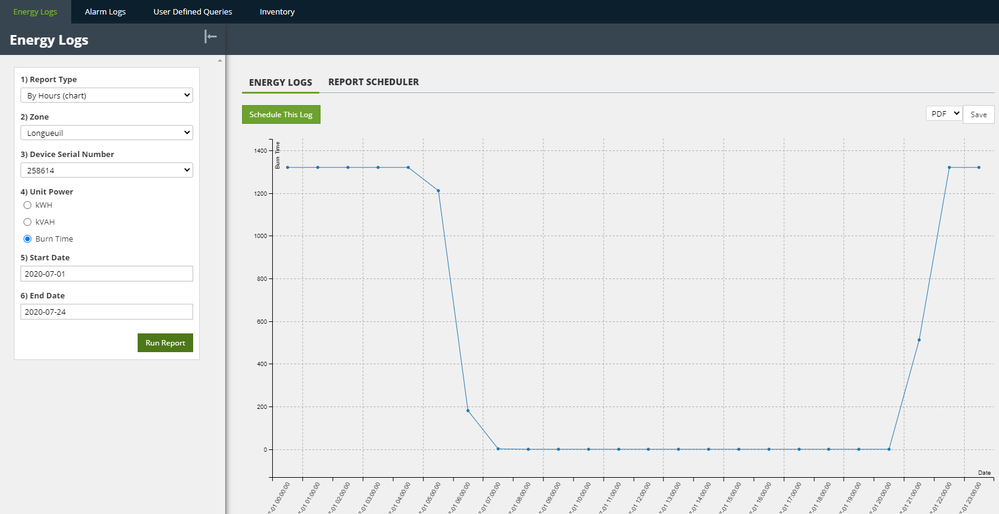
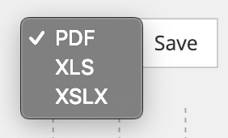
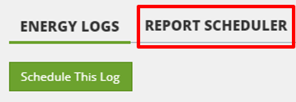
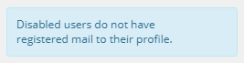

# Energy Logs



test







This section contains information and instructions for using the features accessed via the “Reports– Energy Logs” tab in the Dimonoff \| SCMS platform. Energy logs allow users to consult the metrology data, including the energy consumption, of each node or zone according to several parameters and in the format of a table or a chart.

You can run energy log reports manually and you can also schedule them to run at set intervals.

### Running an Energy Log Report

To run an energy log report, follow these steps:

1. Click the “Reports” menu.

Click the “Energy Logs” tab. The “Energy Logs” dialog appears.

Choose a report type. For an understanding of report types, refer to the section “[Understanding Types of Energy Log Reports]()” below.

The dialog displays options required to complete the type of log you choose.

Complete these other fields. Not all types of report require all the options listed here.

<table>
  <thead>
    <tr>
      <th style="text-align:left"><b>Fields</b>
      </th>
      <th style="text-align:left"><b>Instructions</b>
      </th>
    </tr>
  </thead>
  <tbody>
    <tr>
      <td style="text-align:left">Zone</td>
      <td style="text-align:left">Choose the zone for which you want to run the report.</td>
    </tr>
    <tr>
      <td style="text-align:left">Device Serial Number</td>
      <td style="text-align:left">
        
Enter the serial number of the device for which you want to run a report.

        
From version 20.2.2 of Dimonoff | SCMS, it is possible to enter a serial
          number in the search bar of the drop-down menu, which makes the search
          easier and more efficient.

      </td>
    </tr>
    <tr>
      <td style="text-align:left">Unit Power</td>
      <td style="text-align:left">Enter the unit of power (Burn Time, kVAH, kWH&#x2026;) to use when calculating
        data for the report.</td>
    </tr>
    <tr>
      <td style="text-align:left">Start and End Dates</td>
      <td style="text-align:left">Choose a date range for the energy logs you want to view.</td>
    </tr>
  </tbody>
</table>

Click “Run Report”. The report appears to the right of these options, in the “Energy Logs” tab of the dialog.

You can also schedule this report to run at set intervals by clicking “Schedule This Log”.

To schedule another type of report, you can click on the tab “Report Scheduler”, which will help you create another scheduled report from the start.

For more information, refer to the sections “[Schedule a Report]()”, “[Modifying a Scheduled Report]()” or “[Deleting a Scheduled Report]()”.

#### Understanding the Types of Energy Log Reports

Dimonoff \| SCMS offers 10 types of preconfigured energy log reports:

<table>
  <thead>
    <tr>
      <th style="text-align:left"><b>Report Type</b>
      </th>
      <th style="text-align:left"><b>Explanation</b>
      </th>
    </tr>
  </thead>
  <tbody>
    <tr>
      <td style="text-align:left">By Hours (chart)</td>
      <td style="text-align:left">
        <ul>
          <li>Your screen should look like the one in the example above.</li>
          <li>This type of report measures total energy consumed (in KWH or KVAH) or
            lighting time (in minutes) per hour over a 24-hour period.</li>
          <li>Depending on whether a serial number is selected, the data may show the
            total for only one node or for an entire zone (the one selected in the
            &#x201C;Zone&#x201D; field.</li>
          <li>Depending on the start and end dates selected, the data may show a cumulative
            for several days or only data for one day (example: if the start and end
            dates represent the same date).</li>
          <li>Chart format.</li>
        </ul>
      </td>
    </tr>
    <tr>
      <td style="text-align:left">By Device &#x2013; Detailed</td>
      <td style="text-align:left">
        <ul>
          <li>This type of report measures several parameters (current, voltage, power,
            power factor, light level, etc.) for a node at a configurable frequency
            (automatic polling, which normally varies between 5 and 20 minutes).</li>
          <li>Contains raw data received from nodes. With Dimonoff | SCMS lighting control
            system, the raw data is sent every 4 hours by the gateways to the server
            and the new data is therefore visible every 4 hours.</li>
          <li>By default, with the Dimonoff | SCMS lighting control system, cumulative
            energy consumption data and lighting time are stored in the database by
            default. To have more data (ex: current, voltage and power), you must activate
            the advanced metrology option for each gateway.</li>
          <li>The other report types result from this one.</li>
          <li>Interesting for trouble shooting and to see the quality of communication
            with the node.</li>
          <li>Table format.</li>
          <li><b>Note</b>: Values are cumulative.</li>
          <li><b>Note</b>: For this report to work, a serial number must absolutely
            be selected.</li>
          <li><b>Note</b>: Presents the same values &#x200B;&#x200B;as when doing a
            manual metrology report on a node from the &#x201C;Dashboard&#x201D; menu.</li>
        </ul>
      </td>
    </tr>
    <tr>
      <td style="text-align:left">By Zone By Month</td>
      <td style="text-align:left">
        <ul>
          <li>This type of report measures the total energy consumption or the total
            lighting time for all nodes in a zone, for each month. It presents data
            by month, for a full year.</li>
          <li>Interesting to compare the energy consumption of several months.</li>
          <li>Table format.</li>
          <li><b>Note</b>: Data does not appear if no object is connected for a full
            month.</li>
          <li><b>Note</b>: Values are cumulative.</li>
        </ul>
      </td>
    </tr>
    <tr>
      <td style="text-align:left">By Hours By Day (chart)</td>
      <td style="text-align:left">
        <ul>
          <li>This type of report measures total energy consumed (in KWH or KVAH), lighting
            time (in minutes) or metrology values (provided they are available in the
            advanced metrology data for this gateway) per hour.</li>
          <li>Depending on whether a serial number is selected, the report may show
            data for only one node or for an entire zone (the one selected in the &#x201C;Zone&#x201D;
            field). For a complete zone, the data that can be shown is the first three
            power units only.</li>
          <li>Depending on the start and end dates selected, the data may show a cumulative
            for several days or only data for one day (example: if the start and end
            dates represent the same date).</li>
          <li>Chart format.</li>
        </ul>
      </td>
    </tr>
    <tr>
      <td style="text-align:left">By Day</td>
      <td style="text-align:left">
        <ul>
          <li>This type of report measures the total energy consumption (in KWH or KVAH)
            or the total lighting time (in minutes) of all the nodes of a zone at each
            hour of the day, for an entire date range. You will see the total for the
            day in the 2nd column and the description for each hour of the day to the
            right of this column.</li>
          <li>Table format.</li>
          <li><b>Note</b>: Values are cumulative.</li>
        </ul>
      </td>
    </tr>
    <tr>
      <td style="text-align:left">By Day (chart)</td>
      <td style="text-align:left">
        <ul>
          <li>This type of report measures the total energy consumption (in KWH or KVAH)
            or the total lighting time (in minutes) for all the nodes of a selected
            zone at each hour of the day, for the date range set.</li>
          <li>Depending on the start and end dates selected, the data may show a cumulative
            for several days or only data for one day (example: if the start and end
            dates represent the same date).</li>
          <li>Chart format.</li>
          <li><b>Note</b>: Values are cumulative.</li>
        </ul>
      </td>
    </tr>
    <tr>
      <td style="text-align:left">By Device</td>
      <td style="text-align:left">
        <ul>
          <li>This type of report measures the total energy consumption (in KWH or KVAH)
            or total lighting time (in minutes) of a node at each hour of the day,
            for an entire date range. You will see the total for the range of days
            selected in the 2nd column and the description for each hour of those days
            to the right of this column.</li>
          <li>Table format.</li>
          <li><b>Note</b>: Values are cumulative.</li>
        </ul>
      </td>
    </tr>
    <tr>
      <td style="text-align:left">By Device By Day</td>
      <td style="text-align:left">
        <ul>
          <li>This type of report measures the total energy consumption (in KWH or KVAH)
            or total light time (in minutes) of a node at each hour of the day for
            each day of a date range. You will see the total for the range of days
            selected in the 2nd column and the description for each hour of those days
            to the right of this column.</li>
          <li>Format de tableau.</li>
        </ul>
      </td>
    </tr>
    <tr>
      <td style="text-align:left">By Zone</td>
      <td style="text-align:left">
        <ul>
          <li>This type of report measures the total energy consumption (in KWH or KVAH)
            or total lighting time (in minutes) of all nodes in a selected zone at
            each hour of the day, for the entire a selected date range.</li>
          <li>Table format.</li>
          <li><b>Note</b>: Values are cumulative.</li>
        </ul>
      </td>
    </tr>
    <tr>
      <td style="text-align:left">By Zone By Day</td>
      <td style="text-align:left">
        <ul>
          <li>This type of report measures the total energy consumption (in KWH or KVAH)
            or total lighting time (in minutes) of all the nodes in a zone at each
            hour of the day, for each zone and for each day of a range of dates and
            for each hour of each day.</li>
          <li>Table format.</li>
        </ul>
      </td>
    </tr>
  </tbody>
</table>

### All these types of reports \(except the “By Device – Detailed” one\) are created around 11 AM on the next day and work per 24-hour block, from midnight to midnight.

### Save a Copy of a Report

After you run a report, you can save a copy to several formats. To save a copy of a report, follow these steps:

1. Run a report. For more information, refer to the section “[Running an Energy Log Report]()”.

The report appears on the right side of the dashboard.

Above the report, on the right side, use the formats drop list to choose an export format. The default format, PDF, appears in the drop list.

Click “Save”.

The web browser downloads the report file. The browser may also display a dialog offering the options of saving or opening the file.

Complete any options required. The report file is created on your computer.

### Schedule a Report

You can schedule an energy log report to run at set intervals. To schedule an energy log report, follow these steps:

1. Click the “Reports” menu.

Click the “Energy Logs” tab. The “Energy Logs” dialog appears.

In the right side of this dialog, click “Report Scheduler” \(in red\). A list of existing reports appears.

Click “Add New Schedule”. The “Add New Schedule” dialog appears.

Complete these fields:

<table>
  <thead>
    <tr>
      <th style="text-align:left"><b>Fields</b>
      </th>
      <th style="text-align:left"><b>Instructions</b>
      </th>
    </tr>
  </thead>
  <tbody>
    <tr>
      <td style="text-align:left">Users list</td>
      <td style="text-align:left">
        
Choose the users who need to receive the report. Click the Users check
          box to have the report sent to all users.

        
If some users are grayed out and you are unable to check them, it may
          be because they have not put registered mail to their profile. To add an
          email address, go to the &quot;Security &#x2013; Users&quot; tab.

        

          
        

      </td>
    </tr>
    <tr>
      <td style="text-align:left">Report Type</td>
      <td style="text-align:left">Choose the type of report you want to schedule. For an understanding of
        report types, refer to the section &#x201C;<a href>Understanding Types of Energy Log Reports</a>&#x201D;.</td>
    </tr>
    <tr>
      <td style="text-align:left">Zone</td>
      <td style="text-align:left">Choose the zone for which you want to schedule the report.</td>
    </tr>
    <tr>
      <td style="text-align:left">Device Serial Number</td>
      <td style="text-align:left">
        
Enter the serial number of the device for which you want to schedule a
          report.

        
When you first open this dialog, this drop list may contain no options.
          Options appear once you start completing other fields in the dialog.

      </td>
    </tr>
    <tr>
      <td style="text-align:left">Unit Power</td>
      <td style="text-align:left">Enter the unit of power (Burn Time, kVAH or kWH) to use when calculating
        data for the report.</td>
    </tr>
    <tr>
      <td style="text-align:left">Report Name</td>
      <td style="text-align:left">Enter a name for the report. Include the name of the zone, the device
        serial number unit power or any other information that makes the report&#x2019;s
        content easy to identify from its name alone.</td>
    </tr>
    <tr>
      <td style="text-align:left">File Format</td>
      <td style="text-align:left">
        
Choose the format in which the report is to be delivered (PDF, CSV, XLS
          or XLSX).

        
When you first open this dialog, this drop list may contain no options.
          Options appear once you start completing other fields in the dialog.

      </td>
    </tr>
    <tr>
      <td style="text-align:left">Frequency</td>
      <td style="text-align:left">Determine how often you want the report generated and delivered (Daily,
        Weekly or Monthly). By default, reports are emailed daily at 2:00 p.m.</td>
    </tr>
    <tr>
      <td style="text-align:left">Message</td>
      <td style="text-align:left">Enter an optional message to accompany this report. This message will
        be visible to everyone who receives this email.</td>
    </tr>
  </tbody>
</table>

Click “Save”. The report is scheduled.

**Note**: A scheduled report is visible only to the user who created it.

### Modify a Scheduled Report

To modify a scheduled report, follow these steps:

1. Click the “Reports” menu.

Click the “Energy Logs” tab. The Energy Logs dialog appears.

In the right side of this dialog, click “Report Scheduler”. A list of scheduled reports appears.

Find the report you want to modify and, in the “Actions” column on the far right, click the “Edit icon” \(pencil and paper\).

The “Edit Schedule” dialog appears. It is identical in content to the Add New Schedule dialog.

Use the instructions for the “Add New Schedule” dialog to make any required changes. For more information, refer to the section “[Schedule a Report]()”.

Click “Save”. Your changes have been saved.

### Delete a Scheduled Report

To delete a scheduled report, follow these steps:

1. Click the “Reports” menu.

Click the “Energy Logs” tab. The “Energy Logs” dialog appears.

In the right side of this dialog, click “Report Scheduler”. A list of scheduled reports appears.

Find the report you want to delete and, in the “Actions” column on the far right, click the “Delete" icon \(trash can\).

A confirmation dialog appears.

Click “Yes”.

### Gap Filling

When generating reports by Dimonoff \| SCMS daily at 11 a.m., a reporting mechanism is required when there Is a lack of communication. When this lack of communication with a node lasts less than 24 hours, the Dimonoff \| SCMS system extrapolates the data according to the energy consumption recorded by the node. Therefore, if a few hours are missing from an energy log report, the total missing energy consumption \(in kVAH, burn time, etc.\) will be divided equally into the missing hours.

Otherwise, when there is a lack of communication for more than 24 hours, from midnight to midnight, it is impossible to extrapolate the consumption data and the system will proceed by Gap Filling. For proper operation, two parameters need to be filled in the “Configuration – Devices – Parameters – Consumption Data” menu. These two parameters are the Voltage and Wattage. Moreover, Dimonoff \| SCMS will use the values ​​in “Consumption Data” and estimate the period of time the light was on based on its GPS coordinates and the time of sunrise and sunset at that location. It is also possible to modify the value in Watts of the power of the light in the “Consumption data”, which will take into account whether the light is at full power or if it is dimmed. The Gap Filing only works outdoors, since it takes into account the sunrise and sunset times.

